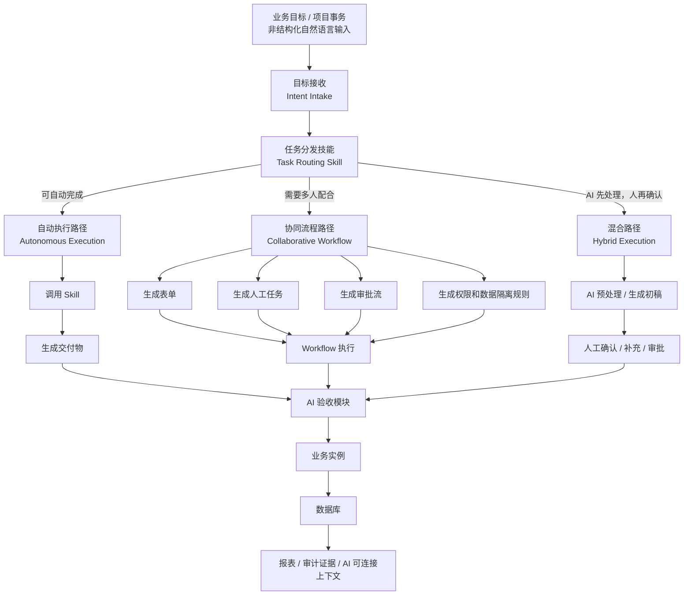
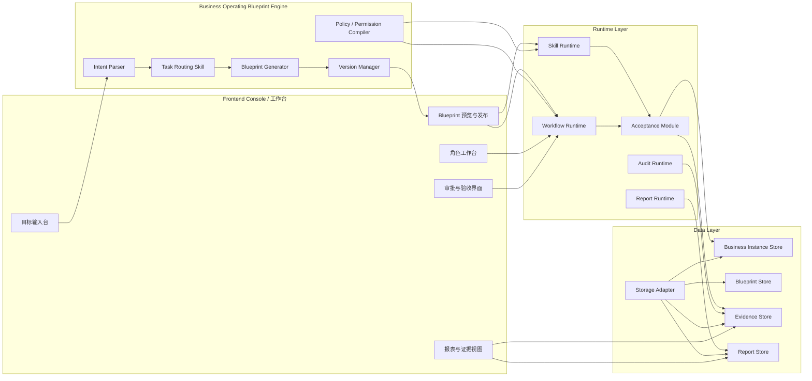
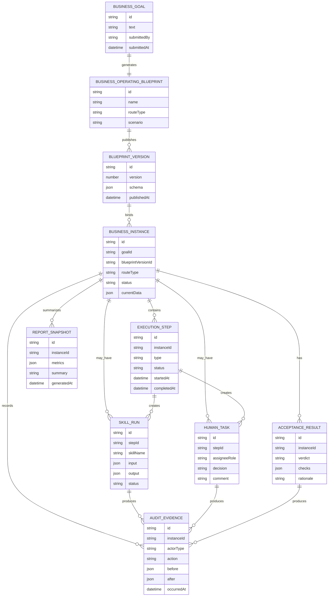
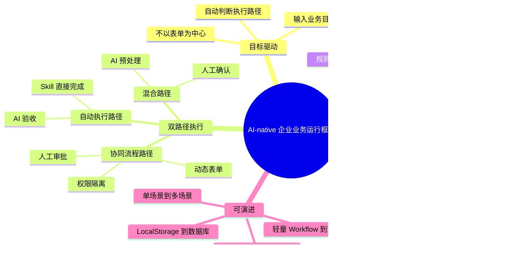

# 业务运行蓝图架构草案

本文档描述产品从“动态表单与审批流程”升级为“AI-native 企业业务运行框架”的目标架构。它是未开发蓝图，用于对齐业务架构、应用架构、数据架构和产品核心竞争力。

## 1. 业务架构

产品的业务起点不是表单，而是一个自然语言表达的业务目标。系统先判断目标应该如何被完成，再生成对应的业务运行蓝图。

### 业务架构的关键判断

- 表单不是入口，业务目标才是入口。
- 审批流不是默认路径，只有需要多人协作时才生成。
- Skill 不是辅助功能，而是自动执行路径的主体。
- AI 验收是统一出口：无论自动执行还是人工协同，都需要形成验收结果。
- 最终沉淀的不是一张表单，而是一个可查询、可审计、可复盘的业务实例。

## 2. 应用架构

应用架构围绕 Business Operating Blueprint 展开。Blueprint Generator 不只生成表单，还要生成任务分发结果、执行计划、协同流程、权限规则、验收规则和报表规则。

### 应用模块说明

| 模块 | 职责 | 当前状态 |
| --- | --- | --- |
| 目标输入台 | 接收业务目标或项目事务 | 需要开发 |
| Task Routing Skill | 判断自动执行、协同流程或混合路径 | 需要开发 |
| Blueprint Generator | 生成业务运行蓝图 | 已有项目审计确定性生成器，需要升级 |
| Skill Runtime | 调用 Skill 自动完成任务 | 需要产品化 |
| Workflow Runtime | 推进人工协同流程 | 已有项目审计流程雏形 |
| Acceptance Module | 对交付物和业务实例进行 AI 验收 | 需要开发 |
| Storage Adapter | 统一持久化边界 | 已有 LocalStorage 版本 |
| Evidence / Report | 审计证据和报表输出 | 已有雏形，需要统一模型 |

## 3. 数据架构

数据架构以业务实例为中心。Business Operating Blueprint 是规则和契约，Business Instance 是运行后的事实记录。

### 数据架构原则

- Blueprint Version 是不可变契约。
- Business Instance 绑定创建时的 Blueprint Version。
- 自动执行和协同流程都必须生成 Business Instance。
- Skill Run、Human Task、Acceptance Result 都必须产生 Audit Evidence。
- 报表不是额外人工整理，而是从业务实例和审计证据生成。

## 4. 产品核心功能与竞争力

### 核心竞争力

1. **从表单驱动升级为目标驱动**
   用户输入业务目标，系统决定如何完成，而不是让用户先设计表单。

2. **AI 是执行者和验收者**
   AI 不只是生成建议或聊天回复，还可以通过 Skill 执行业务动作，并参与验收。

3. **自动执行与人工协同共用同一套框架**
   简单事务走 Skill，复杂事务走表单和 Workflow，最终都沉淀为业务实例。

4. **统一业务上下文对 AI 友好**
   数据、规则、权限、流程状态和审计证据都结构化，AI 不需要临时拼接碎片化接口。

5. **天然支持审计和复盘**
   每次人工动作、Skill 调用、数据变化和验收结论都可以成为证据。

6. **具备从原型到生产的替换路径**
   当前本地存储、确定性生成器和轻量 Workflow 都可以逐步替换为数据库、真实 AI Agent 和生产级流程引擎。

## 5. 当前与目标架构的差距

| 能力 | 当前已有 | 目标状态 |
| --- | --- | --- |
| 非结构化输入 | 项目审计描述生成 Blueprint | 任意业务目标进入 Intent Intake |
| 任务分发 | 暂无独立 Task Routing Skill | 自动判断执行路径 |
| 自动执行 | AI CEO 建议雏形 | Skill Runtime 完成业务交付 |
| 协同流程 | 项目审计表单和审批流已跑通 | 多业务场景可配置生成 |
| 权限隔离 | 前端角色视图和字段权限 | 真实用户、组织和后端权限 |
| 数据存储 | LocalStorage | 数据库与审计证据库 |
| AI 验收 | 尚未独立成模块 | Acceptance Module 调用 Skill 验收 |
| 报表 | 初步报表和建议 | 基于业务实例的通用报表 |

